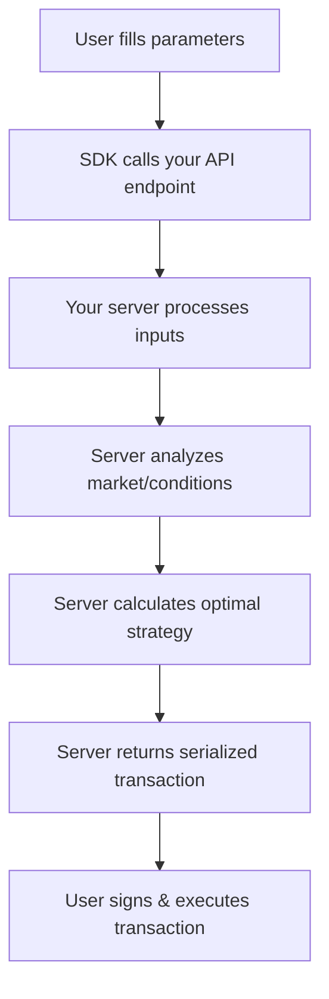

# Dynamic Actions

## The Most Powerful Action Type

Dynamic Actions are the **most sophisticated** action type in the Sherry SDK. They enable complex Web3 operations by leveraging server-side computation to determine the optimal transaction based on user inputs, market conditions, and complex business logic.

## Why Choose Dynamic Actions?

Unlike Blockchain Actions where you call a specific contract function directly, Dynamic Actions let your server:

- **Analyze market conditions** in real-time
- **Calculate optimal routes** across multiple protocols
- **Process complex strategies** that require multiple steps
- **Personalize transactions** based on user profile
- **Adapt to changing conditions** before execution

## Core Concepts

### Interface Definition

```typescript
interface DynamicAction {
  type: 'dynamic';
  label: string; // Button text shown to users
  description?: string; // Optional help text
  chains: ChainContext; // Source blockchain
  path: string; // Your API endpoint
  params?: Parameter[]; // User input parameters
}
```

### Execution Flow



### API Response Requirements

Your endpoint must return an `ExecutionResponse`:

```typescript
interface ExecutionResponse {
  serializedTransaction: string; // Ready-to-execute transaction
  chainId: number; // Chain ID (e.g., 43114 for Avalanche)
  abi?: any[]; // Optional: for verification
  params?: {
    // Optional: for better UX
    functionName: string;
    args: Record<string, any>;
  };
}
```

## Complete Example: DeFi Yield Optimization

### Frontend Configuration

```typescript
import { DynamicAction } from '@sherrylinks/sdk';

const optimalYieldAction: DynamicAction = {
  type: 'dynamic',
  label: 'Find Best Yield',
  description: 'AI-powered yield optimization across 15+ protocols',
  path: '/api/optimize-yield',
  chains: { source: 43114 },
  params: [
    {
      name: 'amount',
      label: 'Investment Amount (USDC)',
      type: 'number',
      required: true,
      min: 100,
      max: 1000000,
      description: 'Minimum $100 for optimal routing',
    },
    {
      name: 'riskTolerance',
      label: 'Risk Tolerance',
      type: 'select',
      required: true,
      options: [
        {
          label: 'Conservative (3-5% APY)',
          value: 'low',
          description: 'Stable protocols only',
        },
        {
          label: 'Moderate (5-12% APY)',
          value: 'medium',
          description: 'Balanced risk/reward',
        },
        {
          label: 'Aggressive (12%+ APY)',
          value: 'high',
          description: 'Higher risk, higher reward',
        },
      ],
    },
    {
      name: 'duration',
      label: 'Investment Duration',
      type: 'radio',
      required: true,
      options: [
        { label: '1 week', value: 7 },
        { label: '1 month', value: 30 },
        { label: '3 months', value: 90 },
        { label: '1 year', value: 365 },
      ],
    },
    {
      name: 'autoCompound',
      label: 'Auto-compound rewards',
      type: 'boolean',
      value: true,
      description: 'Automatically reinvest rewards for compound growth',
    },
  ],
};
```

### Backend Implementation

#### Core API Handler (Next.js)

```typescript
// pages/api/optimize-yield.ts
import { NextRequest, NextResponse } from 'next/server';
import { serialize } from 'wagmi';
import { avalanche } from 'viem/chains';

export async function POST(req: NextRequest) {
  try {
    // Extract parameters from request
    const { searchParams } = new URL(req.url);
    const amount = parseFloat(searchParams.get('amount') || '0');
    const riskTolerance = searchParams.get('riskTolerance');
    const duration = parseInt(searchParams.get('duration') || '30');
    const autoCompound = searchParams.get('autoCompound') === 'true';

    // Input validation
    if (amount < 100) {
      return NextResponse.json({ error: 'Minimum investment is $100' }, { status: 400 });
    }

    if (!['low', 'medium', 'high'].includes(riskTolerance || '')) {
      return NextResponse.json({ error: 'Invalid risk tolerance' }, { status: 400 });
    }

    // Complex server-side computation starts here
    const optimizationResult = await performYieldOptimization({
      amount,
      riskTolerance,
      duration,
      autoCompound,
    });

    // Build and serialize the transaction
    const transaction = await buildOptimalTransaction(optimizationResult);
    const serializedTx = serialize({
      to: transaction.to,
      data: transaction.data,
      value: BigInt(transaction.value || 0),
      chainId: avalanche.id,
    });

    // Prepare response
    const response: ExecutionResponse = {
      serializedTransaction: serializedTx,
      chainId: avalanche.id,
      abi: transaction.abi,
      params: {
        functionName: transaction.functionName,
        args: {
          amount: amount.toString(),
          strategy: optimizationResult.strategyName,
          expectedAPY: `${optimizationResult.projectedAPY}%`,
          protocols: optimizationResult.protocols.map(p => p.name),
          estimatedGas: transaction.estimatedGas,
        },
      },
    };

    return NextResponse.json(response, {
      headers: {
        'Access-Control-Allow-Origin': '*',
        'Access-Control-Allow-Methods': 'POST',
        'Access-Control-Allow-Headers': 'Content-Type',
      },
    });
  } catch (error) {
    console.error('Yield optimization error:', error);
    return NextResponse.json(
      {
        error: 'Failed to optimize yield strategy',
        details: process.env.NODE_ENV === 'development' ? error.message : undefined,
      },
      { status: 500 },
    );
  }
}
```

#### Advanced Optimization Logic

```typescript
async function performYieldOptimization(config: OptimizationConfig) {
  // 1. Fetch current yields from multiple protocols
  const protocolData = await fetchProtocolYields([
    'AAVE',
    'Compound',
    'Yearn',
    'Convex',
    'Curve',
    'TraderJoe',
    'Benqi',
  ]);

  // 2. Filter protocols by risk tolerance
  const filteredProtocols = filterByRiskProfile(protocolData, config.riskTolerance);

  // 3. Calculate optimal portfolio allocation
  const allocation = await calculateOptimalAllocation({
    protocols: filteredProtocols,
    amount: config.amount,
    timeHorizon: config.duration,
    autoCompound: config.autoCompound,
  });

  // 4. Plan execution strategy
  const executionPlan = await planOptimalExecution(allocation);

  return {
    strategyName: executionPlan.name,
    projectedAPY: executionPlan.expectedReturn,
    protocols: allocation.protocols,
    contractAddress: executionPlan.contractAddress,
    functionName: executionPlan.functionName,
    callData: executionPlan.encodedData,
    estimatedGas: executionPlan.gasEstimate,
  };
}

async function fetchProtocolYields(protocols: string[]) {
  const yields = await Promise.allSettled(
    protocols.map(async protocol => {
      try {
        const response = await fetch(`https://api.defillama.com/yields/pool/${protocol}`, {
          timeout: 5000,
        });
        return await response.json();
      } catch (error) {
        console.warn(`Failed to fetch ${protocol} data:`, error);
        return null;
      }
    }),
  );

  return yields
    .filter(result => result.status === 'fulfilled' && result.value)
    .map(result => result.value);
}

function filterByRiskProfile(protocols: any[], riskTolerance: string) {
  const riskThresholds = {
    low: { maxRisk: 3, minAPY: 3 },
    medium: { maxRisk: 6, minAPY: 5 },
    high: { maxRisk: 10, minAPY: 8 },
  };

  const threshold = riskThresholds[riskTolerance];
  return protocols.filter(p => p.riskScore <= threshold.maxRisk && p.apy >= threshold.minAPY);
}

async function calculateOptimalAllocation(config: AllocationConfig) {
  // Implement Modern Portfolio Theory or similar optimization
  const optimizer = new PortfolioOptimizer();

  return optimizer.optimize({
    protocols: config.protocols,
    totalAmount: config.amount,
    timeHorizon: config.timeHorizon,
    autoCompound: config.autoCompound,
    objective: 'maximize_sharpe_ratio',
    constraints: {
      maxProtocolAllocation: 0.4, // Max 40% in any single protocol
      minDiversification: 3, // At least 3 protocols
    },
  });
}
```

## Advanced Use Cases

### Multi-Protocol Arbitrage

```typescript
const arbitrageAction: DynamicAction = {
  type: 'dynamic',
  label: 'Execute Arbitrage',
  description: 'Find and execute profitable arbitrage opportunities',
  path: '/api/find-arbitrage',
  chains: { source: 43114 },
  params: [
    {
      name: 'token',
      label: 'Token to Arbitrage',
      type: 'select',
      required: true,
      options: [
        { label: 'USDC', value: 'usdc' },
        { label: 'USDT', value: 'usdt' },
        { label: 'DAI', value: 'dai' },
        { label: 'WETH', value: 'weth' },
      ],
    },
    {
      name: 'maxSlippage',
      label: 'Max Slippage (%)',
      type: 'number',
      value: 0.5,
      min: 0.1,
      max: 5,
      step: 0.1,
    },
    {
      name: 'minProfit',
      label: 'Minimum Profit ($)',
      type: 'number',
      value: 10,
      min: 5,
      max: 1000,
    },
  ],
};
```

**Backend Logic:**

- Scans 10+ DEXs for price differences
- Calculates optimal route considering gas costs
- Executes flash loan arbitrage if profitable
- Returns single transaction that captures profit

### Dynamic NFT Pricing

```typescript
const dynamicMintAction: DynamicAction = {
  type: 'dynamic',
  label: 'Mint at Current Price',
  description: 'Mint NFT with dynamic pricing based on market conditions',
  path: '/api/nft-dynamic-price',
  chains: { source: 43114 },
  params: [
    {
      name: 'tier',
      label: 'NFT Tier',
      type: 'select',
      required: true,
      options: [
        { label: 'Common', value: 'common' },
        { label: 'Rare', value: 'rare' },
        { label: 'Epic', value: 'epic' },
        { label: 'Legendary', value: 'legendary' },
      ],
    },
    {
      name: 'quantity',
      label: 'Quantity to Mint',
      type: 'number',
      value: 1,
      min: 1,
      max: 10,
    },
  ],
};
```

**Backend Logic:**

- Analyzes current market demand
- Adjusts price based on supply/demand ratio
- Considers whale wallet activity
- Implements dynamic pricing algorithm

### Cross-Chain Route Optimization

```typescript
const crossChainAction: DynamicAction = {
  type: 'dynamic',
  label: 'Optimal Cross-Chain Swap',
  description: 'Find the best route for cross-chain token swaps',
  path: '/api/cross-chain-optimize',
  chains: { source: 43114, destination: 42220 },
  params: [
    {
      name: 'fromToken',
      label: 'From Token (Avalanche)',
      type: 'select',
      required: true,
      options: [
        { label: 'AVAX', value: 'avax' },
        { label: 'USDC', value: 'usdc' },
        { label: 'USDT', value: 'usdt' },
      ],
    },
    {
      name: 'toToken',
      label: 'To Token (Celo)',
      type: 'select',
      required: true,
      options: [
        { label: 'CELO', value: 'celo' },
        { label: 'cUSD', value: 'cusd' },
        { label: 'cEUR', value: 'ceur' },
      ],
    },
    {
      name: 'amount',
      label: 'Amount to Swap',
      type: 'number',
      required: true,
      min: 0.001,
    },
    {
      name: 'maxTime',
      label: 'Max Time (minutes)',
      type: 'select',
      value: 15,
      options: [
        { label: '5 minutes', value: 5 },
        { label: '15 minutes', value: 15 },
        { label: '30 minutes', value: 30 },
        { label: '1 hour', value: 60 },
      ],
    },
  ],
};
```

## Parameter Handling

### Parameter Processing

Dynamic Actions receive parameters as URL query parameters:

```typescript
// Frontend configuration
params: [
  { name: 'amount', label: 'Amount', type: 'number' },
  { name: 'strategy', label: 'Strategy', type: 'select', options: [...] }
]

// Your API receives:
// POST /api/your-endpoint?amount=1000&strategy=aggressive&userAddress=0x...
```

### Best Practices for Parameter Access

```typescript
export async function POST(req: NextRequest) {
  const { searchParams } = new URL(req.url);

  // Type-safe parameter extraction
  const amount = parseFloat(searchParams.get('amount') || '0');
  const strategy = searchParams.get('strategy') as 'conservative' | 'moderate' | 'aggressive';

  // Additional context
  const userAddress = searchParams.get('userAddress');
  const chainId = parseInt(searchParams.get('chainId') || '43114');

  // Validate all inputs
  if (!amount || amount <= 0) {
    return NextResponse.json({ error: 'Invalid amount' }, { status: 400 });
  }

  if (!['conservative', 'moderate', 'aggressive'].includes(strategy)) {
    return NextResponse.json({ error: 'Invalid strategy' }, { status: 400 });
  }

  // Your logic here...
}
```

## Error Handling and Validation

### Comprehensive Error Handling

```typescript
export async function POST(req: NextRequest) {
  try {
    // Input validation layer
    const validationResult = await validateInputs(req);
    if (!validationResult.valid) {
      return NextResponse.json({ error: validationResult.message }, { status: 400 });
    }

    // Business logic layer
    const result = await executeBusinessLogic(validationResult.data);

    return NextResponse.json(result);
  } catch (error) {
    // Log error for debugging
    console.error('Dynamic action error:', {
      error: error.message,
      stack: error.stack,
      url: req.url,
      timestamp: new Date().toISOString(),
    });

    // Return user-friendly error
    if (error instanceof ValidationError) {
      return NextResponse.json({ error: error.message }, { status: 400 });
    }

    if (error instanceof RateLimitError) {
      return NextResponse.json(
        { error: 'Too many requests. Please try again later.' },
        { status: 429 },
      );
    }

    // Generic error for unknown issues
    return NextResponse.json(
      {
        error: 'Unable to process request. Please try again.',
        code: 'INTERNAL_ERROR',
        details: process.env.NODE_ENV === 'development' ? error.message : undefined,
      },
      { status: 500 },
    );
  }
}
```

### Input Validation

```typescript
async function validateInputs(req: NextRequest) {
  const { searchParams } = new URL(req.url);

  // Create validation schema
  const schema = {
    amount: {
      required: true,
      type: 'number',
      min: 0.001,
      max: 1000000,
    },
    riskTolerance: {
      required: true,
      type: 'string',
      enum: ['low', 'medium', 'high'],
    },
    userAddress: {
      required: true,
      type: 'address',
      validator: isValidEthereumAddress,
    },
  };

  const errors = [];
  const data = {};

  for (const [key, rules] of Object.entries(schema)) {
    const value = searchParams.get(key);

    if (rules.required && !value) {
      errors.push(`${key} is required`);
      continue;
    }

    if (value) {
      // Type validation
      if (rules.type === 'number') {
        const numValue = parseFloat(value);
        if (isNaN(numValue)) {
          errors.push(`${key} must be a valid number`);
          continue;
        }
        if (rules.min && numValue < rules.min) {
          errors.push(`${key} must be at least ${rules.min}`);
          continue;
        }
        if (rules.max && numValue > rules.max) {
          errors.push(`${key} must be at most ${rules.max}`);
          continue;
        }
        data[key] = numValue;
      } else if (rules.type === 'string') {
        if (rules.enum && !rules.enum.includes(value)) {
          errors.push(`${key} must be one of: ${rules.enum.join(', ')}`);
          continue;
        }
        data[key] = value;
      } else if (rules.type === 'address') {
        if (rules.validator && !rules.validator(value)) {
          errors.push(`${key} must be a valid address`);
          continue;
        }
        data[key] = value;
      }
    }
  }

  return {
    valid: errors.length === 0,
    message: errors.join(', '),
    data,
  };
}
```

## Performance and Security

### Rate Limiting

```typescript
import { RateLimiter } from 'limiter';

// Create rate limiter (10 requests per minute per IP)
const limiter = new RateLimiter({
  tokensPerInterval: 10,
  interval: 'minute',
});

export async function POST(req: NextRequest) {
  const clientIP = req.ip || req.headers.get('x-forwarded-for') || 'unknown';

  const allowed = await limiter.removeTokens(1, clientIP);
  if (!allowed) {
    return NextResponse.json({ error: 'Rate limit exceeded' }, { status: 429 });
  }

  // Continue with normal processing...
}
```

### Caching Strategies

```typescript
import Redis from 'ioredis';

const redis = new Redis(process.env.REDIS_URL);

export async function POST(req: NextRequest) {
  // Create cache key from parameters
  const { searchParams } = new URL(req.url);
  const cacheKey = `yield-optimization:${searchParams.toString()}`;

  // Check cache first
  const cached = await redis.get(cacheKey);
  if (cached) {
    console.log('Cache hit for:', cacheKey);
    return NextResponse.json(JSON.parse(cached));
  }

  // Perform expensive calculation
  const result = await performYieldOptimization(/* params */);

  // Cache result for 5 minutes
  await redis.setex(cacheKey, 300, JSON.stringify(result));

  return NextResponse.json(result);
}
```

### Security Best Practices

```typescript
export async function POST(req: NextRequest) {
  // Validate origin
  const origin = req.headers.get('origin');
  const allowedOrigins = process.env.ALLOWED_ORIGINS?.split(',') || [];

  if (process.env.NODE_ENV === 'production' && !allowedOrigins.includes(origin)) {
    return NextResponse.json({ error: 'Unauthorized origin' }, { status: 403 });
  }

  // Rate limiting by user address
  const userAddress = req.headers.get('x-wallet-address');
  if (userAddress) {
    const userRequestCount = await redis.incr(`requests:${userAddress}`);
    if (userRequestCount === 1) {
      await redis.expire(`requests:${userAddress}`, 3600); // 1 hour window
    }
    if (userRequestCount > 100) {
      // Max 100 requests per hour per address
      return NextResponse.json({ error: 'User rate limit exceeded' }, { status: 429 });
    }
  }

  // Sanitize and validate all inputs
  const sanitizedInputs = sanitizeInputs(req);

  // Continue with processing...
}

function sanitizeInputs(req: NextRequest) {
  const { searchParams } = new URL(req.url);

  return {
    amount: Math.max(0, Math.min(parseFloat(searchParams.get('amount') || '0'), 1000000)),
    userAddress: searchParams.get('userAddress')?.toLowerCase().trim(),
    // Add more sanitization as needed
  };
}
```

## When to Use Dynamic Actions

### Perfect Use Cases

- **Multi-protocol yield optimization**
- **Real-time arbitrage detection**
- **Complex cross-chain routing**
- **AI-powered trading strategies**
- **Dynamic pricing calculations**
- **Market-dependent decisions**
- **Multi-step transaction planning**
- **Portfolio rebalancing**

### Not Recommended For

- **Simple token transfers** (use Transfer Actions)
- **Fixed-price NFT minting** (use Blockchain Actions)
- **Static contract calls** (use Blockchain Actions)
- **Basic approve/transfer flows**
- **Operations that don't require server computation**

## Deployment Checklist

### Pre-Production Verification

- [ ] **Performance**: API responds in less than 2 seconds
- [ ] **Error Handling**: Graceful error messages for all scenarios
- [ ] **Rate Limiting**: Protection against abuse
- [ ] **Monitoring**: Comprehensive logging and alerting
- [ ] **Caching**: Expensive calculations are cached appropriately
- [ ] **Security**: All inputs validated and sanitized
- [ ] **Testing**: Comprehensive test coverage including edge cases
- [ ] **Documentation**: API endpoints and behavior documented
- [ ] **Fallbacks**: Graceful degradation when external services fail
- [ ] **CORS**: Proper cross-origin resource sharing configuration

### Monitoring and Observability

```typescript
// Add comprehensive logging
export async function POST(req: NextRequest) {
  const startTime = Date.now();
  const requestId = generateRequestId();

  console.log('Dynamic action started:', {
    requestId,
    url: req.url,
    userAgent: req.headers.get('user-agent'),
    timestamp: new Date().toISOString(),
  });

  try {
    const result = await processRequest(req);

    console.log('Dynamic action completed:', {
      requestId,
      duration: Date.now() - startTime,
      success: true,
    });

    return NextResponse.json(result);
  } catch (error) {
    console.error('Dynamic action failed:', {
      requestId,
      duration: Date.now() - startTime,
      error: error.message,
      stack: error.stack,
    });

    throw error;
  }
}
```

## Next Steps

- [**Blockchain Actions**](./blockchain-actions) - When direct contract calls are sufficient
- [**Transfer Actions**](./transfer-actions) - For simple native token transfers
- [**Action Flows**](./nested-action-flows) - Combine Dynamic Actions in multi-step workflows
- [**Parameters Guide**](../parameters/parameters) - Master parameter configuration
